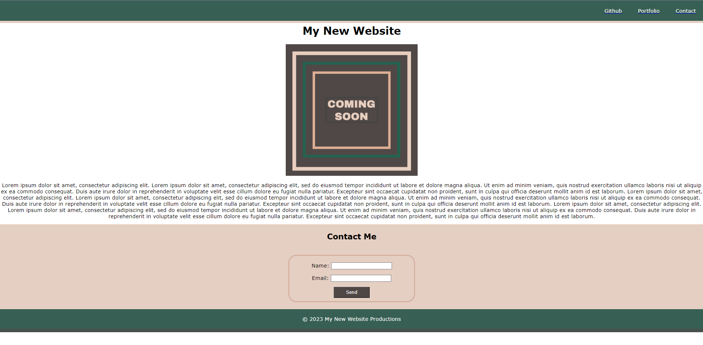

# Module 01 Mini-Project

## Description

The purpose of this project was to demonstrate my ability to use basic HTML and CSS functionality to create a basic webpage. 

**What was your motivation?** My main motivation for building this webpage was to get ancillary practice in basic HTML and CSS use cases. 
**Why did you build this project?** Although this was not a "mandatory" project, I wanted to expand on my knowledge and understanding of HTML and CSS. 
**What problem does it solve?** This webpage itself, does not solve any problems. However, my personal exposure to HTML and CSS is non-existent. That said, the main problem this page solves is granting me more and more exposure to HTML and CSS concepts and practices. 
**What did you learn?** One week before I built this webpage, I had no exposure to HTML or CSS, so I learned a great amount from this activity. Some of the big things I learned include: 

**HTML**
- Organizing content for SEO and accessibility 
- Using the href attribute to create usable links
- Create header, main, and footer 
- Add images to the HTML using the href attribute 
- Add alt text to images
- Add ID attributes to HTML elements

**CSS**
- Establishing a font family for the entire page
- Use of aesthetic properties such as color and background color
- Apply CSS properties to multiple selectors 
- Use several CSS properties such as position, margin, and padding 

## Usage
While there's not much usage for end user application with this webpage, the exercise’s main priority was to help establish basic CSS and HTML concepts in novice developers. The image below demonstrates the end result of the aesthetic goals of this developer. 

## Credits
The original goals and deliverables were presented by Denver University in the Bootcamp course ID DU-VIRT-FSF-PT-12-2023-U-LOLC-MWTH under Module 1 Activity. All code was generated and submitted by Jordan R. Heersink. 

MIT License

Copyright (c) 2023 Jordan Heersink

Permission is hereby granted, free of charge, to any person obtaining a copy
of this software and associated documentation files (the "Software"), to deal
in the Software without restriction, including without limitation the rights
to use, copy, modify, merge, publish, distribute, sublicense, and/or sell
copies of the Software, and to permit persons to whom the Software is
furnished to do so, subject to the following conditions:

The above copyright notice and this permission notice shall be included in all
copies or substantial portions of the Software.

THE SOFTWARE IS PROVIDED "AS IS", WITHOUT WARRANTY OF ANY KIND, EXPRESS OR
IMPLIED, INCLUDING BUT NOT LIMITED TO THE WARRANTIES OF MERCHANTABILITY,
FITNESS FOR A PARTICULAR PURPOSE AND NONINFRINGEMENT. IN NO EVENT SHALL THE
AUTHORS OR COPYRIGHT HOLDERS BE LIABLE FOR ANY CLAIM, DAMAGES OR OTHER
LIABILITY, WHETHER IN AN ACTION OF CONTRACT, TORT OR OTHERWISE, ARISING FROM,
OUT OF OR IN CONNECTION WITH THE SOFTWARE OR THE USE OR OTHER DEALINGS IN THE
SOFTWARE.

## **This is the end of original content from Jordan Heersink. The original readme provided by Denver University is below. **

# Module 01 Mini-Project: Landing Page

In this mini-project, you will build a landing page using HTML and CSS. While you will be responsible for your own landing page, you will work in a group to brainstorm and share ideas.

## Instructions

Work in your group to implement the following user stories:

* As a client, I want to view a single webpage that collects a visitor's contact information.

* As a client, I want the landing page to have a header and footer.

* As a client, I want the landing page to have an image with a caption.

* As a client, I want the landing page to have a contact form.

* As a client, I want the landing page to have a polished and accessible UI.

## Acceptance Criteria

* It's done when the page uses semantic HTML elements.

* It's done when the page uses universal, element, and class selectors in CSS.

* It's done when the page features at least three colors in the design.

* It's done when the page uses a single font and font family for all text.

* It's done when the page uses at least two heading elements (`<h1>` through `<h6>`).

* It's done when the header is fixed to the top of the page on scroll.

* It's done when the header contains a navigation bar with three links that display inline, including a contact link.

* It's done when, if the contact link is clicked, the page jumps directly to the contact form.

* It's done when the contact form includes `input` elements for name and email.

* It's done when the contact form includes a Send button.

* It's done when the image includes a descriptive `alt` attribute.

* It's done when the page is deployed to GitHub Pages.

## Sample Page
* The following screenshot is provided as an **example** of what you can do, but be creative! As long as you complete all of the acceptance criterions, any landing page is acceptable. 

* Note: The **Coming Soon box** is an image that is provided in the `assets/image-1.png` directory. 

## 💡 Notes

Follow these instructions to deploy your project to GitHub Pages:

1. Create a new repository on your GitHub account and clone it to your computer.

2. When you're ready to deploy, use the `git add`, `git commit`, and `git push` commands to save and push your code to your GitHub repository.

3. Navigate to your GitHub repository in the browser and then select the Settings tab on the right side of the page.

4. On the Settings page, select Pages on the left side of the page. On the GitHub Pages screen, choose `main` in the dropdown under Branch. Click the Save button.

5. Navigate to <your-github-username.github.io/your-repository-name> and you will find that your new webpage has gone live! For example, if your GitHub username is "lernantino" and the project is "css-demo-site", then your URL would be <lernantino.github.io/css-demo-site>.

> **Important**: It might take a few minutes for GitHub pages to display your site correctly. If your project does not deploy or display correctly, check that all file paths in your application are relative and use the right casing. GitHub is case-sensitive, an incorrect capital or lowercase letter could cause problems in deployment.

## 💡 Hints

Refer to the documentation:

* [MDN Web Docs on HTML elements](https://developer.mozilla.org/en-US/docs/Web/HTML/Element)

* [MDN Web Docs on color](https://developer.mozilla.org/en-US/docs/Web/CSS/color)

* [MDN Web Docs on font](https://developer.mozilla.org/en-US/docs/Web/CSS/font)

* [MDN Web Docs on HTML section heading elements](https://developer.mozilla.org/en-US/docs/Web/HTML/Element/Heading_Elements)

* [MDN Web Docs on how to structure a web form](https://developer.mozilla.org/en-US/docs/Learn/Forms/How_to_structure_a_web_form)

* [MDN Web Docs on the button element](https://developer.mozilla.org/en-US/docs/Web/HTML/Element/button)

* [MDN Web Docs on the figure element](https://developer.mozilla.org/en-US/docs/Web/HTML/Element/figure)

* [Full-Stack Blog HTML Cheatsheet](https://coding-boot-camp.github.io/full-stack/html/html-cheatsheet)

## 🏆 Bonus

If you have completed this activity, work through the following challenge with your group to further your knowledge:

* How can CSS be used to apply a different style to an `<a>` element when a cursor points at it?

Use [Google](https://www.google.com) or another search engine to research this.

---

© 2023 edX Boot Camps LLC. Confidential and Proprietary. All Rights Reserved.
